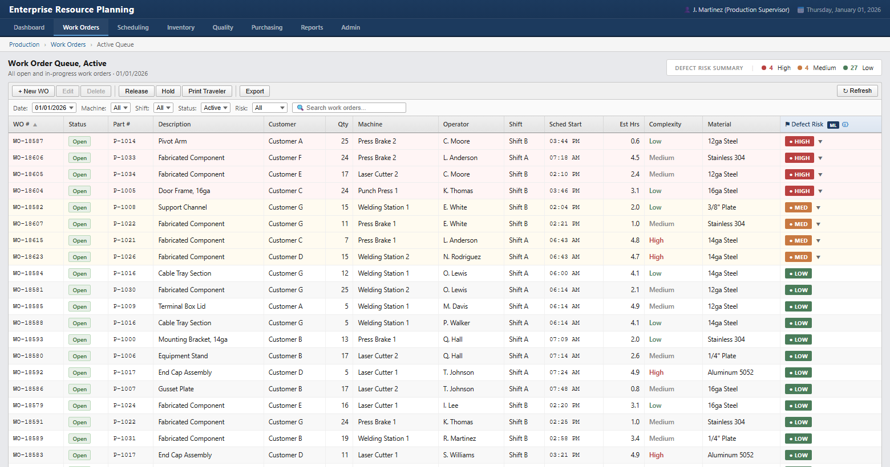
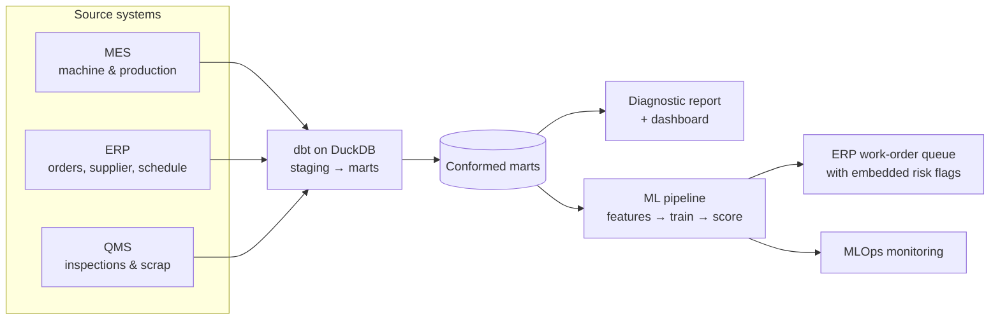

# Manufacturing Data Platform: Defects & Scrap Costs

**An end-to-end data platform for a mid-sized manufacturer, spanning data engineering, analytics and machine learning, applied to defects and scrap cost.**

It starts with a **data pipeline** that integrates machine, order and quality data from three disconnected systems into a single modeled dataset.

An **analytics and ML layer** is then built on top of that integrated dataset, including:

1. **Analytics diagnostics report** that uncovers the sources of elevated defect risks and scrap costs
2. **KPI dashboard** that tracks key outcomes related to defects and scrap costs, laid out by week and month
3. **Machine learning model** that predicts defect risks and flags them before a job runs, supported by technical documentation and MLOps monitoring in production

The machine learning model's defect risk predictions are embedded into the company's existing ERP system, as shown below:

[](https://brimsystems.github.io/mfg-quality-scrap/docs/index.html)

> **[Open the live ERP work-order queue &rarr;](https://brimsystems.github.io/mfg-quality-scrap/docs/index.html)** &nbsp;·&nbsp; **[All six deliverables &rarr;](https://brimsystems.github.io/mfg-quality-scrap/)**

---

## Business Context

A sheet-metal fabricator (~$30M revenue) was losing margin to elevated defect rates. To date, the company's approach to managing defects and scrap data consisted of reviewing scrap tallies after the fact, a manual and labor-intensive process that assigned cost but couldn't explain cause.

The data that explained these elevated defect rates was already being captured, just split across three disconnected systems: machine and production data in the MES, supplier, operator, and schedule data in the ERP, and inspection outcomes in the QMS. Integrating these disparate systems revealed the operating conditions that drive defects, for example an aging machine running a high-complexity job on a thin-gauge lot late in the schedule.

Going forward, defect risk is known before a job runs, and the conditions behind it are visible while there is still time to change the setup, the material or the schedule.

---

## Deliverables

| # | Deliverable | What it is | Links |
|---|---|---|---|
| 1 | **ERP work-order queue** (primary) | The model embedded in a JobBOSS-style queue: each job's defect-risk tier and top contributing driver, shown inline. | [Live](https://brimsystems.github.io/mfg-quality-scrap/docs/index.html) &middot; [File](docs/index.html) |
| 2 | Analytics diagnostic report | Where defects and scrap cost concentrate across machine, shift, operator, material, supplier, and complexity, and the cross-system combinations that compound risk. | [Live](https://brimsystems.github.io/mfg-quality-scrap/docs/reports/report.html) &middot; [File](docs/reports/report.html) |
| 3 | Analytics dashboard | The recurring monthly view of defect-rate and scrap-cost KPIs with trailing-twelve-month trends. | [Live](https://brimsystems.github.io/mfg-quality-scrap/docs/reports/dashboard.html) &middot; [File](docs/reports/dashboard.html) |
| 4 | ML model overview & performance | A plain-language model card: what the model predicts, how it performs, the scrap it helps avoid, and its limits. | [Live](https://brimsystems.github.io/mfg-quality-scrap/docs/reports/ml_overview.html) &middot; [File](docs/reports/ml_overview.html) |
| 5 | ML technical report | Training data, model selection, validation and test metrics, calibration, confusion matrix, and SHAP feature importance. | [Live](https://brimsystems.github.io/mfg-quality-scrap/docs/reports/ml_technical.html) &middot; [File](docs/reports/ml_technical.html) |
| 6 | MLOps monitoring report | Monitoring across periods on four layers (performance, target, prediction, and feature drift) with a rules-based retraining decision. | [Live](https://brimsystems.github.io/mfg-quality-scrap/docs/reports/monitoring_report.html) &middot; [File](docs/reports/monitoring_report.html) |

---

## How it works



Raw extracts from the three source systems, with the integration problems that come with them (mismatched IDs, inconsistent naming, varying granularity), are combined by a tested dbt pipeline into conformed marts. Those marts feed the analytics report and dashboard and the ML pipeline. The data is split by time into training, validation, and test sets; three candidate classifiers are tuned and the best is registered. Scoring runs as a monthly batch, and each period is monitored against training and validation references.

---

## Results

All figures below are read directly from the reports in this repository.

- **Diagnosis (39 months, January 2023 to March 2026):** 8.4K defects across 139.5K inspected parts, a 6.0% part-level defect rate, and $609K in scrap cost, concentrated in three cross-system drivers: Bending work on Shift B, Supplier C material, and high-complexity parts.
- **Model:** a gradient-boosted classifier reaches a ROC-AUC of 0.76 on the held-out test set. In the January 2026 scoring window, its High-risk flags were correct 97% of the time (32 of 33), so a planner reviewing just those jobs is almost never wasting time.
- **Value:** the defective jobs the model correctly flagged that month carried about $8.5K in scrap; preventing those defects before release would avoid roughly $102K a year.
- **Monitoring:** across the three monitored periods the model held within every retraining threshold, so the standing decision is no action.

Operationally, the diagnosis tells managers where to intervene, and the model turns those same patterns into a per-job flag at the point of release, so the shop can act before the scrap is made rather than after.

---

## Data

The datasets were generated to represent typical records from the source systems involved (MES, ERP, and QMS), so the full workflow can be demonstrated on data that is safe to share publicly; the [generators are in `data_source/generate/`](data_source/generate/).

---

## Running it locally

```bash
# 1. Environment
python3 -m venv .venv
source .venv/bin/activate          # Windows: .venv\Scripts\activate
pip install -e .                   # project + dependencies from pyproject.toml

# 2. Generate data and build the warehouse
python3 -m data_source.generate.run_generator
cd data_pipeline && dbt build && cd ..

# 3. Analytics (diagnostic report + dashboard)
cd analytics/reports && python3 generate_report.py && python3 generate_dashboard.py && cd ../..

# 4. ML lifecycle (train -> score -> monitor)
cd ml
python3 src/training.py            # trains, selects, registers the production model
python3 src/scoring.py             # monthly batch scoring with SHAP drivers
python3 src/monitoring.py          # four-layer drift and performance monitoring
cd ..

# 5. Client-facing report generators
cd ml/reports
python3 generate_erp_dashboard.py
python3 generate_ml_overview.py
python3 generate_ml_technical.py
python3 generate_monitoring_report.py
cd ../..
```

The report generators write standalone HTML; the copies served by GitHub Pages live under [`docs/`](docs/).

---

## Stack

| Layer | Tools |
|---|---|
| Integration & transformation | dbt, DuckDB |
| Analytics & reporting | Python, pandas, matplotlib, HTML/CSS |
| Modeling | XGBoost, scikit-learn, Optuna, SHAP |
| MLOps | MLflow (tracking & registry), Evidently (drift), Prefect (orchestration) |
| Delivery | Static HTML, GitHub Pages |

---

Brian Davis, fractional data engineering and analytics partner for SMB manufacturers &middot; brian@brimsystems.com
